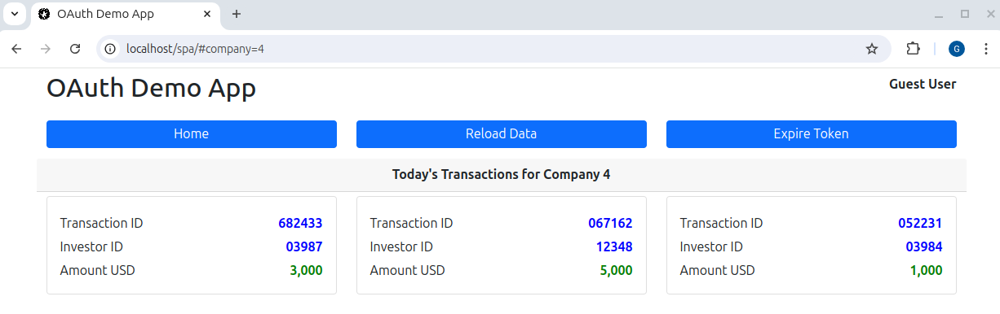

# Initial OAuth SPA and API Code Sample

[](https://app.codacy.com/gh/gary-archer/oauth.websample1?utm_source=github.com&utm_medium=referral&utm_content=gary-archer/oauth.websample1&utm_campaign=Badge_Grade)

[](https://snyk.io/test/github/gary-archer/oauth.websample1?targetFile=spa/package.json)
[](https://snyk.io/test/github/gary-archer/oauth.websample1?targetFile=api/package.json)

## Overview

An introductory standards-based SPA and API code sample, to get integrated with OAuth endpoints:

- The SPA uses the traditional OpenID code flow with PKCE.
- The SPA interacts with an API that validates JWTs and uses claims-based authorization.

## Views

The SPA is a simple UI with some basic navigation between views, to render fictional investment resources.



## Local Development Quick Start

To run the code sample locally you must configure some infrastructure before you run the code.

### Configure DNS and SSL

Configure custom development domains by adding these DNS entries to your hosts file:

```bash
127.0.0.1 localhost www.authsamples-dev.com api.authsamples-dev.com
```

Install OpenSSL 3+ if required, create a secrets folder, then create development certificates:

```bash
export SECRETS_FOLDER="$HOME/secrets"
mkdir -p "$SECRETS_FOLDER"
./certs/create.sh
```

Finally, configure [Browser SSL Trust](https://github.com/gary-archer/oauth.blog/tree/master/public/posts/developer-ssl-setup.mdx#trust-a-root-certificate-in-browsers) for the SSL root certificate at this location:

```text
./certs/authsamples-dev.ca.crt
```

### Run the Code

Ensure that Node.js 24+ is installed, then build and run the SPA and API:

```bash
./start.sh
```

The system browser runs and you can sign in with my AWS test credentials:

- User: `guestuser@example.com`
- Password: `GuestPassword1`

## Further Information

* See the [Sample 1 Overview](https://github.com/gary-archer/oauth.blog/tree/master/public/posts/basicspa-overview.mdx) for a summary of behaviour.
* See the [Sample 1 Details](https://github.com/gary-archer/oauth.blog/tree/master/public/posts/basicspa-execution.mdx) for further details on running the code.

## Programming Languages

* The SPA and its views use plain TypeScript code.
* The API uses Node.js and TypeScript.

## Infrastructure

* Express is used as the HTTP server for the secured API.
* The Webpack development server is used to serve the SPA's static content.
* The SPA uses the [oidc-client-ts](https://github.com/authts/oidc-client-ts) library to implement OpenID Connect.
* The API uses the [jose](https://github.com/panva/jose) library to validate JWT access tokens.
* AWS Cognito is the default authorization server for the SPA and API.

## Limitations

- The SPA uses tokens in the browser, which is against 2021 security best practices.
- The SPA uses the original iframe-based silent token renewal which has some usability problems.
- The [Updated SPA Code Sample](https://github.com/gary-archer/oauth.websample2) progresses the SPA further.
